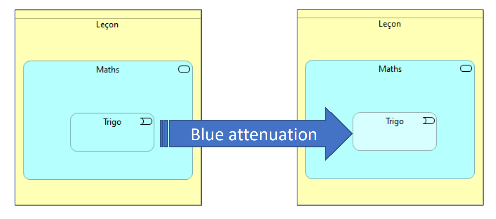
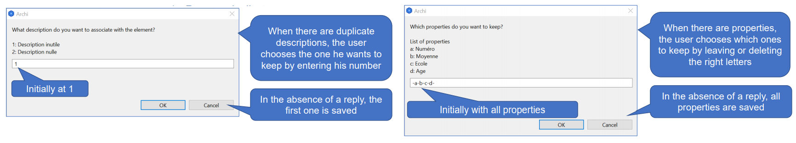
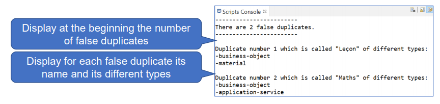
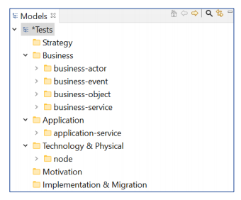
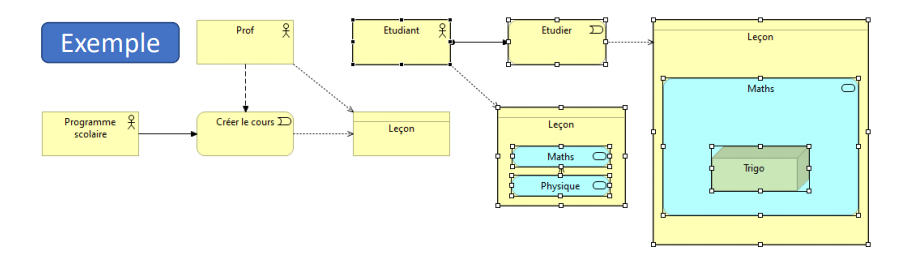
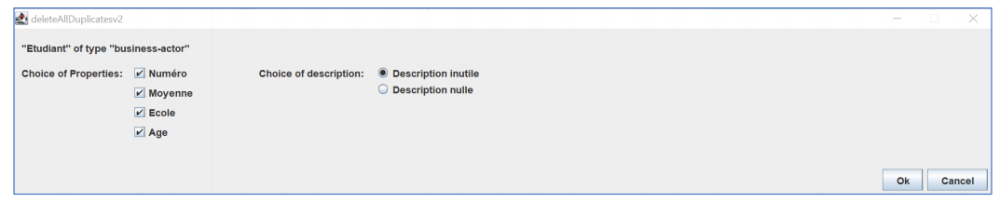

<!-- Internship Scripts -->
## Internship Scripts
Archimate is an open source software that allows IT architects to make schemas covering the different parts of a single enterprise project. jArchi is a plug-in that allows scripts to be executed in Archimate and my internship demonstrated its usefulness in the daily work of the department. 

<!-- TABLE OF CONTENTS -->

  
Table of Contents

  <ol>
    <li>changeColor.ajs</a></li>
    <li>deleteAllDuplicates.ajs</a></li>
    <li>deleteAllDuplicatesAuto.ajs</a></li>
    <li>detectionFauxDoublons.ajs</a></li>
    <li>mooveFolder.ajs</a></li>
    <li>mooveFolderView.ajs</a></li>
    <li>newView.ajs</a></li>
    <li>changeColorv2.ajs and deleteAllDuplicatesv2.ajs</a></li>
  </ol>

<!-- changeColor.ajs -->
## changeColor.ajs
When the engineers who worked with me made their diagrams, many boxes of the same colour regularly overlapped. To make it easier to see the blocks, I created a program that decreases the colour of the element as shown in the diagram below:

The concept is easy to understand. The user selects the element and chooses a percentage of attenuation. Then, the script does the work.

<!-- deleteAllDuplicates.ajs -->
## deleteAllDuplicates.ajs
This programme is the main objective of my internship. What are duplicates? A duplicate is a couple of elements that have the same name and type. They cause problems when submitting projects and therefore need to be deleted (manually before my internship). This diagram shows how the script works:

<!-- deleteAllDuplicatesAuto.ajs -->
## deleteAllDuplicatesAuto.ajs
This script is simply an automatic version of the duplicate processing. It selects all properties and the first description.

<!-- detectionFauxDoublons.ajs -->
## detectionFauxDoublons.ajs
This script is used to detect false duplicates. These are simply pairs of elements with the same name but a different type.

<!-- mooveFolder.ajs -->
## mooveFolder.ajs
The items are automatically sorted into six folders. However, within each folder there are many items with different subtypes. This script is used to sort each item into subfolders to add visibility to the project. If an item is already in the right folder, then it is not moved (possibility to rearrange the file after a first sorting and modifications of the model).

<!-- mooveFolderView.ajs -->
## mooveFolderView.ajs
While the last script sorted all the elements of the project, this one sorts only those of a chosen  view. The objective is to sort the elements progressively and more quickly.

<!-- newView.ajs -->
## newView.ajs
This script allows you to create a new view from part of the elements of another view. This simplifies any presentation of the project to a third party.

<!-- changeColorv2.ajs and deleteAllDuplicatesv2.ajs -->
## changeColorv2.ajs and deleteAllDuplicatesv2.ajs
These last two scripts are improvements on two previously presented scripts using the Swing library. These are the last scripts I created during my internship.

<!-- PS -->
## PS
The file extensions have been changed to .js in github in order to be able to visualize the scripts better (the .ajs extension not being recognized in github).
